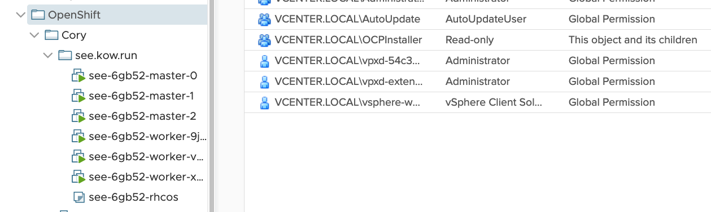

# OpenShift 4.4+ Calico (Windows) Install

This repository helps automate the install of OpenShift 4.x
with Calico CNI for use with Windows containers

Note: Running these scripts on a Linux workstation with internet access is assumed

## QuickStart
```
# pull this repo
git clone https://github.com/codekow/demo-ocp-calico.git
cd demo-ocp-calico

# setup vmware roles (optional)
. hacks/vsphere_roles.sh
vsphere_create_roles

# easy install button :)
hacks/install_ocp_calico.sh

# run openshift-install
openshift-install create cluster --dir generated/ocp-calico-install
```

## VMware Notes

Assumption: Two vCenter Accounts
- Admin Account
- Installer Account (w/ roles assigned)

### Admin Account

`hacks/vsphere_roles.sh` is available to help automate the creation of vCenter roles with a vCenter administrator account.

### Installer Account

Assign the following roles to the vCenter account being used to install OpenShift at various levels in vCenter listed below.

### Precreated virtual machine folder in vSphere vCenter

Role Name | Propagate | Entity
--- | --- | ---
openshift-vcenter-level | False | vCenter
ReadOnly | False | Datacenter
openshift-cluster-level | True | Cluster
openshift-datastore-level | False | Datastore
ReadOnly | False | Switch
openshift-portgroup-level | False | Port Group
ReadOnly | True | Virtual Machine folder (Top Level)
openshift-folder-level | True | Virtual Machine folder

In a cascading (nested) folder organization you will need  "`Read-only`" permissions 
with "`Propagate to children`" from the top folder level.

Example Service Account: `OCPInstaller`



## ToDO
- Convert hacks to Ansible

## Links

Tigera Docs
- [OpenShift 4.x Calico Install (Windows)](https://projectcalico.docs.tigera.io/getting-started/windows-calico/openshift/installation)
- [OpenShift 4.x Calico Install](https://docs.tigera.io/getting-started/openshift/installation)
- [OpenShift 4.x Calico Enterprise Upgrade](https://docs.tigera.io/maintenance/openshift-upgrade)

OpenShift Docs
- [OpenShift 4.10 OVN Hybrid Networking](https://docs.openshift.com/container-platform/4.10/networking/ovn_kubernetes_network_provider/configuring-hybrid-networking.html)
- [vCenter Account Priviledges](https://docs.openshift.com/container-platform/4.10/installing/installing_vsphere/installing-vsphere-installer-provisioned.html#installation-vsphere-installer-infra-requirements_installing-vsphere-installer-provisioned)
